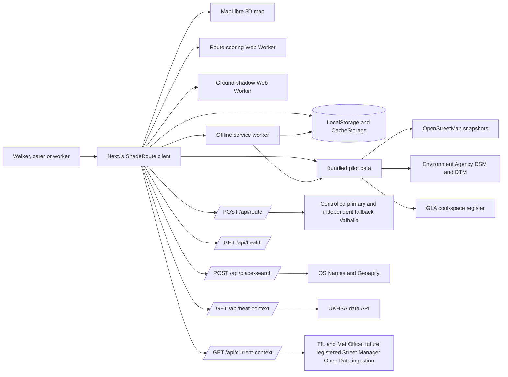
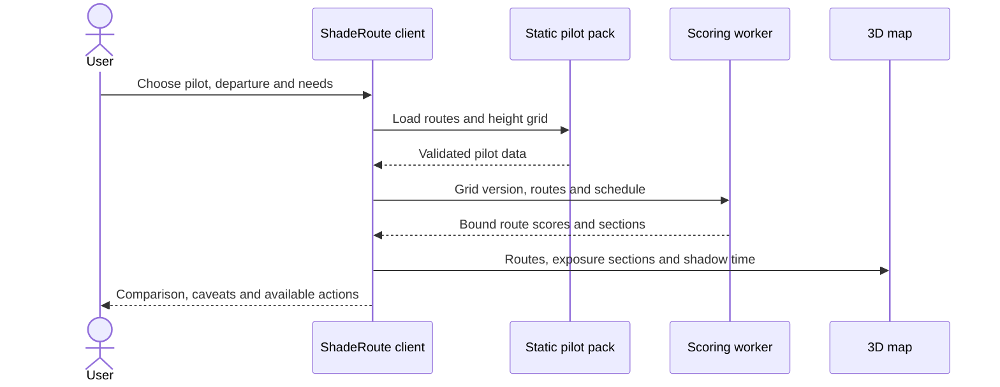

# System Architecture — ShadeRoute

## Overview

ShadeRoute is a mobile-first, single-page Next.js application deployed as a
Cloudflare-compatible Worker through Vinext. It compares walking alternatives
inside two bounded London pilot areas using time-dependent, clear-sky shadow
geometry derived from Environment Agency elevation data. The application is a
planning-support prototype: it exposes missing data and uncertainty, and it
does not claim to measure thermal comfort, medical risk or step-free access.

The design keeps the largest data packs and calculations in the browser. The
server surface is deliberately small: bounded proxies protect routing and
optional place/current-context services, while a fail-neutral proxy caches
regional UKHSA context. There is no
application account system or server database; saved journeys, operational
feedback and prepared offline packs remain on the user's device.

## Key requirements

### Functional

- Compare one to three real walking alternatives for each supported journey.
- Recalculate direct-sun exposure as departure time and walking pace change.
- Animate a 3D, time-dependent ground-shadow view.
- Support repeated occupational journeys and guarded departure advice.
- Accept arbitrary endpoints only inside a supported pilot area.
- Work with bundled pilot routes after an explicit offline preparation step.
- Export a bounded, privacy-conscious decision record.

### Non-functional

- Mobile-first and keyboard-operable, with reduced-motion and forced-colour support.
- Preserve interaction responsiveness by moving heavy raster work to Web Workers.
- Fail closed on malformed, stale or out-of-area routing data.
- Keep routing responses private and non-cacheable.
- Make missing model coverage visible and prevent it improving a route score.
- Avoid collecting accounts, automatic location histories or server-side journey logs.
- Use open data and free or open-source services for the pilot.

## High-level architecture

The browser owns the interactive map, route comparison and device-local state.
The Worker API protects external services with bounded payloads, timeouts and
validation, while static pilot data feeds the two calculation workers. Browser
storage is the system's only application data store; D1 and R2 are not used.

## Component details

### Web client

**Responsibilities**

- Owns journey, profile, schedule, pace, selected route and UI state.
- Presents a decision-first comparison before the 3D explanation.
- Coordinates route fetching, score calculation and cancellation generations.
- Presents loading, empty, error, success and limited-confidence states.

**Technology**

- React 19, Next.js App Router APIs and Vinext.
- TypeScript with strict checking.
- Plain CSS with component-scoped CSS where isolation is important.

**Owned data**

- Ephemeral planning state in React.
- Explicitly saved journey shortcuts and operational feedback in LocalStorage.

### 3D map

**Responsibilities**

- Renders local roads, water, green space and extruded buildings.
- Displays up to three walking alternatives and selected-route exposure sections.
- Displays animated ground shadows and bounded local context records.

**Technology**

- MapLibre GL JS with local GeoJSON-derived pilot maps.
- Raster shadow output rendered as an image source over the map.

### Route-scoring worker

**Responsibilities**

- Loads the selected height grid once per version.
- Densifies and projects route geometry at a bounded interval.
- Traces sunlight obstruction using absolute terrain and a surface envelope.
- Produces ordered sun, shade, uncertain, unknown and night sections.
- Aggregates repeated journeys and scans departure alternatives.

**Important invariants**

- Unknown daylight counts conservatively as potential direct sun.
- Advice is withheld for insufficient coverage, low sun, overlapping sensitivity
  ranges, immaterial savings or access-guard conflicts.
- Results are generation-bound so stale work cannot overwrite a newer request.

### Ground-shadow worker

**Responsibilities**

- Renders the map-wide shadow frame for a supplied time and pilot grid.
- Coalesces pending renders to the latest request.
- Transfers grid buffers once and returns an image-compatible raster.

The synchronous implementation remains a deterministic fallback when Web
Workers are unavailable.

### Route API

**Endpoint:** `POST /api/route`

**Responsibilities**

- Accepts only finite start and destination coordinates inside one pilot.
- Accepts only the bounded `standard` or `avoid-known-steps` access preference.
- Bounds request and response sizes.
- Uses independent per-endpoint timeouts inside a total deadline.
- Validates geometry, summaries, endpoints, model bounds and manoeuvre indexes.
- Deduplicates near-identical alternatives and returns at most three.
- Returns private, non-cacheable responses with non-blaming errors.

**External integration:** a loopback-only Greater London Valhalla profile is
provided under `ops/valhalla/` and is the fail-closed default. Public FOSSGIS is
used only when deliberately configured as a local-development fallback. A public
pilot must use a controlled primary and genuinely independent fallback.
Credentials, if needed, are bounded server-only
headers. A per-runtime aggregate gate limits rate and concurrency without
retaining an IP address, user agent, coordinate or route.

When `avoid-known-steps` is requested, the proxy applies Valhalla's maximum
documented pedestrian step-transition penalty before alternatives are generated.
This is a routing preference over mapped data, not a step-free guarantee; the
client still inspects returned instructions and withholds access-conflicting
suggestions.

### Place-search API

**Endpoint:** `POST /api/place-search`

- Normalises and bounds the typed query before provider access.
- Uses server-only OS Names and/or Geoapify credentials.
- Filters every provider result to the exact selected pilot box.
- Debounces client requests and preserves bundled places when online search is
  disabled, rate-limited or unavailable.
- Keeps responses private and caches only an opaque digest of the bounded query
  in process memory; the raw query is not logged by ShadeRoute.
- Keeps the current-year OS copyright/database-right statement and OS API
  terms link, plus the `Powered by Geoapify` and OpenStreetMap links, visible.

### Heat-context API

**Endpoint:** `GET /api/heat-context`

The route fetches the official London UKHSA heat-health metric. A bounded server
cache provides fresh data, then a time-limited stale fallback. When neither is
available, it returns a neutral unavailable response. The documented empty page
is a valid `no_active_alert` state rather than a provider failure. Heat context
never changes route ranking, and no-alert copy does not promise individual safety.

### Current-context API

**Endpoint:** `GET /api/current-context?area=waterloo|kings-cross`

All lookups use fixed corridor stations, weather points and British National
Grid boxes rather than user endpoints. TfL can use explicitly enabled cached
anonymous access or a server key; Met Office is disabled until its server key is
supplied. Street Manager remains unconditionally disabled. DfT's third-party
framework requires public-facing apps and journey-planning services to consume
its separately registered Open Data service rather than re-serve authenticated
GeoJSON data. That feed requires notification verification, missed-event
reconciliation, persistent current-state ingestion and retention ownership,
none of which this stateless prototype claims to provide. The retained future
ingestion parser applies an inclusive current-instant-to-seven-days overlap
filter locally, so historical and distant-future records cannot be presented as
current context. The UI message states this external gate, says that a future
works record would not establish pavement closure, and never feeds current
context into route ranking.

### Health and operational signals

`GET /api/health` is a liveness check only and discloses no environment or
dependency detail. Heat and route handlers emit allow-listed structured lines
with coarse duration, outcome, delivery path, pilot ID and route count. The
builders deliberately drop coordinates, geometry, search text, IP addresses
and user-agent values. Public alerting, retention and incident ownership remain
deployment responsibilities.

### Static data pipeline

`scripts/prepare-data.mjs` produces the pilot packs from the checked-in source
material. It retains:

- Bounded map features and building multipolygons with inner holes.
- A validity mask so nodata is not confused with flat terrain.
- Absolute terrain and minimum/maximum surface elevations.
- Legacy relative-height grids only for backwards compatibility.
- Source dates and processing metadata.

Generated binary and JSON artefacts live under `public/data/` and are versioned
with the application.

`scripts/prepare-public-trees.mjs` independently refreshes the official GLA
November 2025 public-realm tree inventory. Its strict streaming parser keeps
only `Highways` points within each pilot plus a 250 m selection buffer, records
the exact source hash and modification time, and can check without writing.
These points are context only: they are not canopy polygons and never modify
the elevation-derived shade model.

### Offline service worker

Offline preparation is explicit rather than automatic. It stages one selected
pilot pack, verifies the expected responses, promotes the pack atomically, and
only then removes the previous version. `/api/*` is never cached. A waiting
service-worker update activates only after a visible user action.

### Device-local storage

There is no server database. Browser storage holds:

- Up to 20 saved journey setups.
- Up to 500 operational feedback records.
- Offline-pack readiness records and verified CacheStorage entries.

Records are schema-versioned, bounded and rejected rather than silently
overwriting unknown future versions. Exports are formula-sanitised where CSV is
used, and the decision-evidence JSON excludes exact endpoint coordinates and
route geometry.

A separate calibration store can hold up to 500 strict fixed-point records. It
uses one explicit location reading or manually entered physical coordinates,
requires a Europe/London observation time, freezes the model state before
observed sun/shade controls appear, and exports the repository's versioned 23-column
CSV schema. It is not joined to operational feedback or silently published.

## Data flow

### Bundled journey comparison

The calculation is tied to the exact area, route-array identity, departure,
profile, pace and schedule. A changed input immediately invalidates the previous
answer; only the latest generation may update the interface.

### Custom journey

1. The client validates the chosen points against the active pilot bounds.
2. `POST /api/route` forwards them to a bounded Valhalla attempt.
3. A timeout or invalid primary response permits the configured fallback attempt.
4. The server compacts and validates all usable alternatives.
5. The client independently checks the response identity and structure.
6. The scoring worker calculates the same model outputs as a bundled journey.

### Offline preparation

1. The user explicitly chooses **Prepare this pilot for offline use**.
2. The client supplies a versioned asset manifest to the service worker.
3. The service worker populates a staging cache and verifies every response.
4. Verified entries are copied to the ready cache and checked again.
5. The readiness record is stored locally; a failed refresh leaves the previous
   verified pack untouched.

## Data model

The high-level entities are:

- **PilotArea** — identifier, bounding box, named endpoints and data-pack paths.
- **WalkingRoute** — validated geometry, duration, distance and manoeuvres.
- **HeightGrid** — grid metadata, validity, terrain and surface envelopes.
- **ScheduleScore** — aggregate exposure plus one immutable score per journey.
- **ExposureSection** — ordered geometry classified as sun, shade, uncertain,
  unknown or night.
- **SavedJourney** — bounded device-local planning preferences.
- **FieldFeedback** — device-local operational report about a modelled section.
- **DecisionEvidence** — strict, bounded, coordinate-free model output record.

Routes and grids are immutable inputs to a score. Device-local records are not
joined to server-side identities because no account or server persistence exists.

## Infrastructure and deployment

- **Development:** Vinext development server and local Cloudflare bindings.
- **Controlled local routing:** Docker Compose on loopback with a version-pinned
  Valhalla image and Greater London Geofabrik extract.
- **Production build:** ESM Cloudflare Worker plus static assets in `dist/`.
- **Hosting target:** OpenAI Sites on Cloudflare-compatible infrastructure.
- **Persistence:** D1 and R2 are deliberately unset in `.openai/hosting.json`.
- **Environments:** local and hosted builds share the same application logic;
  hosted routing endpoints can be supplied through environment configuration.

No hosted ShadeRoute deployment is claimed until a Sites project and deployment
status exist.

## Scalability and reliability

- Large pilot files are static and cacheable; private route responses are not.
- Height grids are transferred to workers once per version.
- Route geometry preparation is bounded and cached with an LRU policy.
- Latest-generation guards prevent slow work replacing fresh results.
- Per-endpoint and total routing deadlines prevent a hanging primary consuming
  the fallback budget.
- Heat context uses stale-while-failing behaviour without changing route scores.
- Offline packs are staged and promoted atomically.
- The installable manifest is independent of verified offline readiness; an
  installed shell is not presented as proof that a corridor pack is available.
- Fixed synthetic requests check Valhalla readiness, application liveness and
  both published pilot journeys without using a person's route.

The current architecture is intentionally corridor-sized. UK-wide coverage would
need tiled model packs, a controlled routing deployment and a formal data-refresh
pipeline rather than simply increasing the existing bounding boxes.

## Security and compliance

- Server inputs and upstream response sizes are bounded before full decoding.
- Only HTTPS routing endpoints are accepted, except loopback URLs for local tests.
- Route API responses use `private, no-store` headers.
- Exact custom coordinates are sent only when the user requests live routing.
- Online place text is sent only after a bounded query is typed and is not
  stored by ShadeRoute; upstream-provider retention still requires review.
- There is no automatic server-side storage, account profile or analytics payload.
- Local exports disclose their privacy boundary before download.
- Data-source licences and attribution remain visible in the product.

The system handles journey locations that can reveal sensitive routines. A real
deployment still requires a documented privacy assessment, retention policy for
infrastructure logs, dependency review and legal review of operational claims.

## Observability

Current observability is deliberately privacy-bounded:

- User-visible states distinguish loading, recoverable failure, success and
  limited confidence.
- API status codes separate validation (`400`) from temporary upstream failure
  (`503`).
- Deterministic tests cover parsers, bounds, timeouts, cancellation and model logic.
- Fixed synthetic checks cover local router/application readiness and both
  public pilot endpoint pairs.
- Route and UKHSA handlers emit structured allow-listed event lines without
  journey coordinates or persistent user identifiers.

There is no central metrics backend, dashboard or alert receiver. Before a
public pilot, connect the existing records to a bounded-retention sink and add
worker/offline-integrity counters, an incident owner and a tested rollback path.

## Design decisions and trade-offs

| Decision | Rationale | Trade-off |
| --- | --- | --- |
| Local corridor packs | Predictable hackathon demo and offline preparation | Not UK-wide |
| 4 m surface envelope | Keeps browser data and ray tracing tractable | Loses some 1 m detail; uncertainty must remain visible |
| Absolute terrain plus min/max surface | Preserves slope and sub-cell obstacle bounds | Larger pack than an 8-bit relative-height raster |
| Clear-sky geometry only | Explainable and testable | Does not model clouds, radiant heat or thermal comfort |
| Web Workers with sync fallback | Responsive UI with broad compatibility | Duplicate execution paths require parity tests |
| Device-local personal state | Minimises collection and account burden | No cross-device sync or server recovery |
| Unknown counted as sun | Missing data cannot improve recommendations | Conservative estimates can understate benefits |

## Future improvements

1. Complete field calibration and publish route-order and direct-sun error metrics.
2. Replace repeated directional ray work with validated horizon-angle tiles where
   benchmarks show a material benefit.
3. Add per-cell survey epoch and change masks so coverage includes freshness.
4. Put the controlled router and privacy-bounded operational events under a
   named service owner with an independent fallback and alerting.
5. Tile and stream data packs before expanding beyond the two pilots.
6. Add independent real-device, assistive-technology and security testing.
