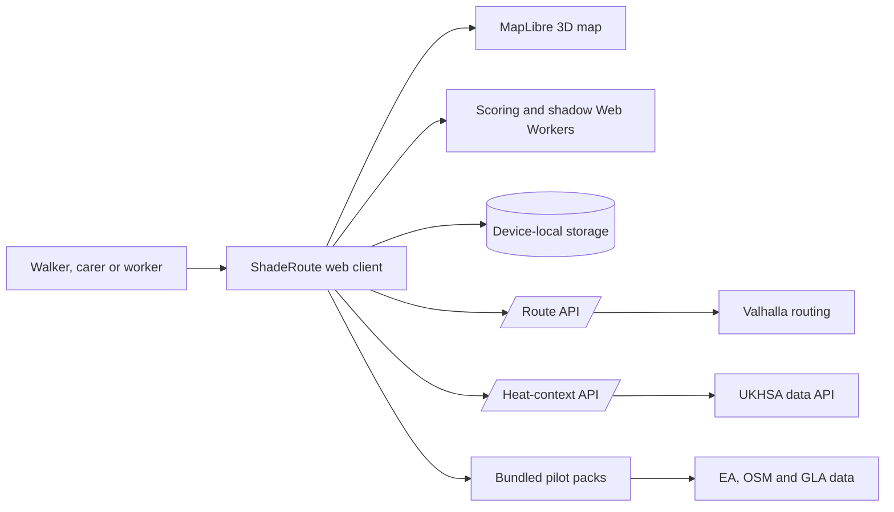
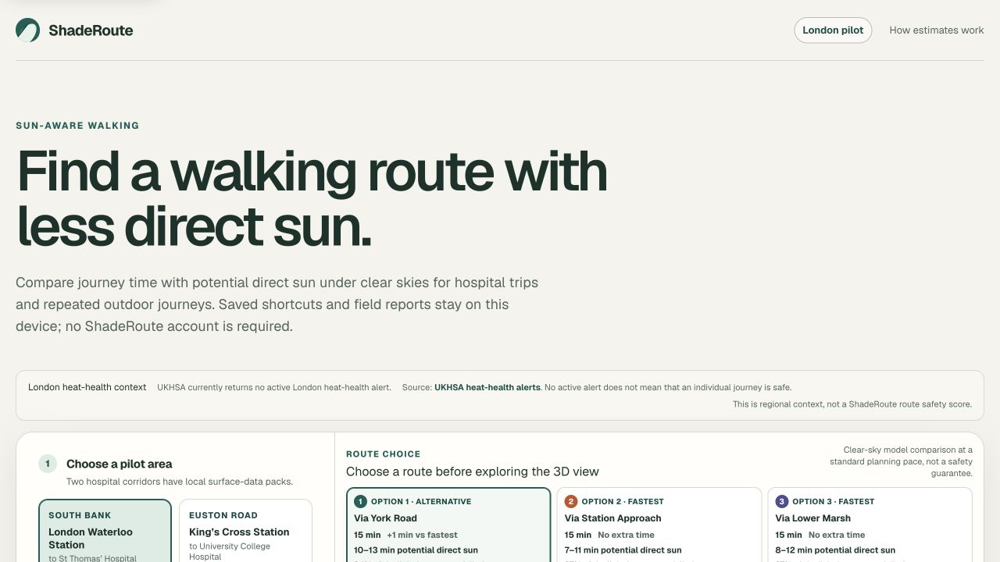
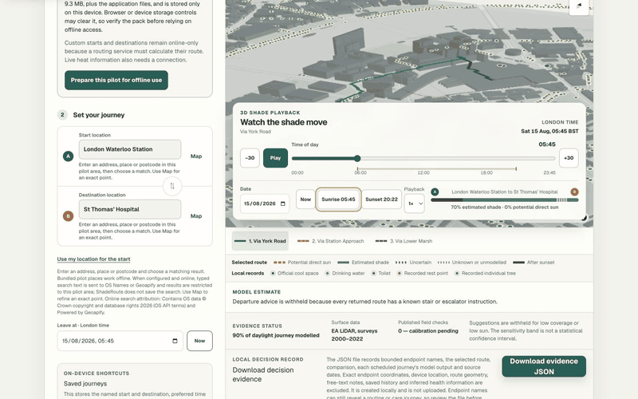
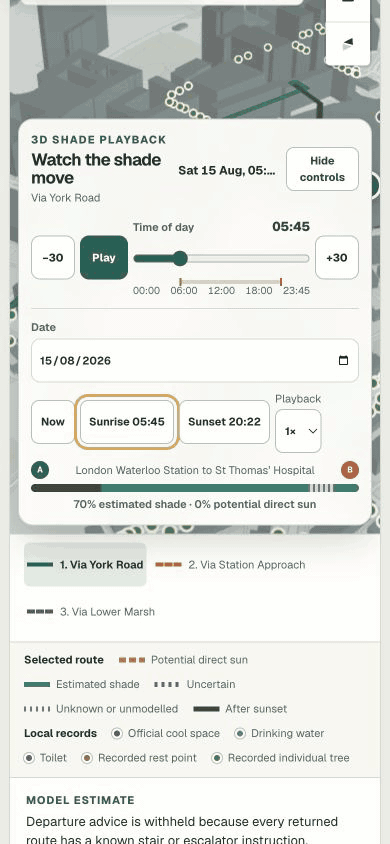
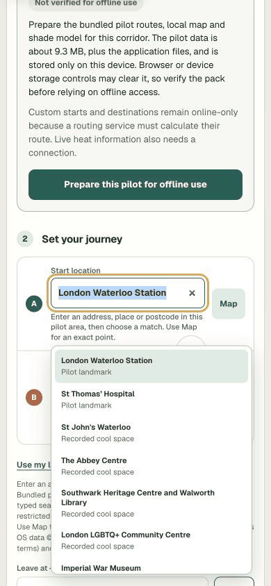

# ShadeRoute

> Mobile-first walking-route comparison using time-dependent clear-sky shade estimates.


## Description

ShadeRoute compares real walking alternatives by journey time and potential
direct-sun exposure. It is designed for heat-vulnerable people and their carers,
frontline staff and outdoor workers who repeat exposed journeys. The current
Frontline London prototype covers two hospital corridors:

- London Waterloo Station to St Thomas’ Hospital.
- King’s Cross Station to University College Hospital.

The application uses Environment Agency elevation data, a time-aware geometric
shade model and open walking routes to explain trade-offs rather than issue a
safety score. Missing model coverage is shown and conservatively counted as
potential direct sun. Physical field calibration is still pending.

## Table of contents

- [Features](#features)
- [Technology stack](#technology-stack)
- [Architecture overview](#architecture-overview)
- [Installation](#installation)
- [Usage](#usage)
- [Configuration](#configuration)
- [Screenshots and demo](#screenshots-and-demo)
- [API reference](#api-reference)
- [Tests](#tests)
- [Data and responsible use](#data-and-responsible-use)
- [Roadmap](#roadmap)
- [Contributing](#contributing)
- [Licence](#licence)
- [Contact and support](#contact-and-support)

## Features

- Two bundled London hospital pilot corridors.
- One to three real route alternatives with time and potential direct-sun comparison.
- Arbitrary start and destination points inside each supported pilot area.
- Local landmark and partial amenity search without a commercial geocoder.
- 3D MapLibre map with buildings and animated, time-dependent ground shadows.
- Selected-route sections marked as sun, shade, uncertain, unknown or night.
- Slow, standard and brisk planning presets without claiming measured walking speed.
- Repeated occupational journeys and a per-trip exposure timeline.
- Guarded departure advice that is withheld when evidence is weak or access rules conflict.
- Access, surface, crossing, data-age and coverage warnings.
- Device-local saved journeys and operational section feedback.
- Explicit, verified and removable offline packs for bundled pilot journeys.
- Strict local JSON decision-evidence export with exact coordinates and geometry excluded.
- Regional UKHSA heat-health context shown separately from route scoring.
- Latest-request cancellation so stale routing or calculations cannot replace current results.

## Technology stack

| Layer | Technology |
| --- | --- |
| Application | React 19, TypeScript, Next.js App Router APIs, Vinext |
| Hosting runtime | Cloudflare-compatible Worker and static assets |
| Map | MapLibre GL JS |
| Solar position | SunCalc 2 |
| Routing | Valhalla pedestrian routing through a guarded server proxy |
| Model data | Environment Agency LiDAR DSM and DTM, OpenStreetMap, GLA Cool Space Data |
| Background work | Browser Web Workers with deterministic synchronous fallbacks |
| Device storage | LocalStorage and CacheStorage; no application server database |
| Tests | Node test runner, ESLint and TypeScript |

## Architecture overview



Most data and calculation work stays in the browser. The server exposes only
bounded proxies for live walking alternatives and regional heat context, while
personal shortcuts, feedback and offline data remain on the device. See
[ARCHITECTURE.md](ARCHITECTURE.md) for component responsibilities, invariants,
data flow and deployment details.

## Installation

### Requirements

- Node.js 22.13.0 or newer.
- npm, using the checked-in lockfile.
- A modern browser with WebGL for the full 3D map; the route comparison remains
  the primary decision surface.

### Set up from a clean checkout

```bash
git clone <ADD_REPOSITORY_URL>
cd shade-route
npm ci
```

No API key is required for the bundled pilots. The default live-routing endpoint
is a public fair-use service and has no service-level guarantee.

## Usage

Start the local application:

```bash
npm run dev
```

Open <http://localhost:3000/> and:

1. Choose one of the two pilot corridors.
2. Set the departure time, audience, pace and access preference.
3. Compare the route cards before using the 3D map explanation.
4. Move the time control to see the ground-shadow pattern change.
5. Optionally prepare the selected bundled pilot for offline use.

Create a production build:

```bash
npm run build
```

Rebuild pilot artefacts after deliberately updating source data under `data/`:

```bash
node scripts/prepare-data.mjs
```

Generated data must be reviewed, tested and attributed before it is committed.

## Configuration

All configuration is optional for the bundled pilots.

| Variable or file | Purpose | Default |
| --- | --- | --- |
| `VALHALLA_URL` | Server-only primary route endpoint | FOSSGIS public Valhalla route endpoint |
| `VALHALLA_FALLBACK_URL` | Server-only independent fallback route endpoint | Unset |
| `.openai/hosting.json` | Logical Sites persistence bindings | D1 and R2 disabled |
| `public/data/` | Versioned pilot maps, routes, grids and context | Checked-in pilot artefacts |

Routing endpoints must use HTTPS. Loopback HTTP is accepted only for local
development and tests. Do not expose private provider keys to browser code.

## Screenshots and demo

### Presentation and video

[Download the 2–3 minute presentation (PPTX)](docs/demo/shaderoute-frontline-london-demo.pptx)

[Watch the narrated 2 minute 17 second demonstration (MP4)](docs/demo/shaderoute-frontline-london-demo.mp4)
or [download the English caption file](docs/demo/shaderoute-frontline-london-demo.en-GB.srt).

The presentation and video use real ShadeRoute interface captures. They describe
clear-sky model estimates and retain the project limitation that physical field
calibration is pending.

### Product screenshots




[](docs/demo/shaderoute-frontline-london-demo.mp4)

The animated preview is silent; select it to watch the full narrated demonstration.

### Desktop

[](docs/demo/shaderoute-frontline-london-demo.mp4)

### Mobile

[](docs/audit/shade-time-movement.mp4)



[Watch the shade-time interaction evidence (MP4)](docs/audit/shade-time-movement.mp4).
The recording shows the controlled clear-sky model changing from sunrise through
late morning; it is interface evidence, not field-validation evidence.

A public live URL has not been established because Sites is not enabled for the
current workspace. Run the project locally using the instructions above; do not
interpret a missing deployment URL as evidence that the application has been
field-validated.

## API reference

### `POST /api/route`

Returns up to three validated walking alternatives when both points are inside
the same supported pilot area.

```bash
curl -X POST http://localhost:3000/api/route \
  -H 'content-type: application/json' \
  --data '{
    "origin": {"lat": 51.5033, "lon": -0.1132},
    "destination": {"lat": 51.4983, "lon": -0.1187}
  }'
```

Success:

```json
{
  "areaId": "waterloo",
  "routes": [
    {
      "id": "live-1",
      "distanceMetres": 1234,
      "durationSeconds": 901,
      "geometry": [[-0.1132, 51.5033], [-0.1187, 51.4983]],
      "directions": []
    }
  ]
}
```

The real geometry contains more coordinates and may return fewer than three
alternatives. Invalid inputs return `400`; temporary upstream failure returns
`503`. Every response is private and non-cacheable.

### `GET /api/heat-context`

Returns narrowly parsed London UKHSA context. It can return a time-limited stale
record when the provider is unavailable, or a neutral `503` unavailable record.
This endpoint never changes route ranking.

There is no public CLI.

## Tests

Run the production build and all deterministic tests:

```bash
npm test
```

Run static checks separately:

```bash
npm run lint
npx tsc --noEmit
```

The test suite covers route and API validation, timeout/fallback behaviour,
worker protocols, absolute-terrain shade geometry, London civil time, repeated
journeys, decision evidence, offline-pack atomicity, accessibility surface
requirements and responsible product claims.

Automated tests do not substitute for physical shade observations, real-device
offline checks, assistive-technology testing or user research.

## Data and responsible use

- **Routes and map:** OpenStreetMap contributors, ODbL.
- **Elevation:** Environment Agency LiDAR Composite DSM and DTM, Open Government
  Licence v3. Surveys in the composite may date from 2000–2022.
- **Cool spaces:** Greater London Authority Cool Space Data 2025 under London
  Datastore terms; listing and opening are not live.
- **Solar geometry:** SunCalc 2.
- **Heat context:** official UKHSA London metric, displayed separately.

ShadeRoute is an uncalibrated clear-sky geometric model. It does not measure
temperature, radiant heat, thermal comfort or heat-illness risk. It does not
certify routes as step-free, open or safe. Temporary works, foliage, clouds,
indoor sections, pavement position and current street conditions can differ.

The field form stores operational feedback about a modelled section; it is not
physical calibration evidence. The fixed-point protocol and empty observation
template are in [`validation/`](validation/README.md).

## Roadmap

- Complete and publish field calibration across both corridors and varied sun angles.
- Add per-cell survey epoch and change detection to the model confidence surface.
- Prove offline reload and update behaviour on representative mobile devices.
- Add privacy-bounded operational monitoring and a controlled routing deployment.
- Validate horizon-angle acceleration before adopting it for wider-area packs.
- Expand geography only through tiled, provenance-aware model packs.

See [RESEARCHER.md](RESEARCHER.md) for the evidence-ranked technical roadmap.
The task-by-task completion record is in [TASK-TRACEABILITY.md](TASK-TRACEABILITY.md).

## Contributing

1. Open an issue describing the user need, affected pilot and safety implications.
2. Keep changes small and avoid weakening model, privacy or access disclosures.
3. Add deterministic tests for new parsing, geometry, error or state behaviour.
4. Run the build, test, lint and TypeScript checks.
5. Submit a pull request that states data provenance, known limitations and any
   manual evidence collected.

Never add invented field observations or label an unverified route as safe,
step-free or medically protective.

## Licence

No project-wide software licence has been declared. Do not assume permission to
reuse or redistribute the source until the maintainer adds a `LICENSE` file.
The open-data licences and attribution obligations listed above are separate
from the software copyright.

## Contact and support

No maintainer name, email address, repository URL or public support channel was
provided. Until those are supplied, use the issue tracker associated with the
repository containing this source. For an immediate medical or public-safety
emergency, use the appropriate emergency service rather than ShadeRoute.
