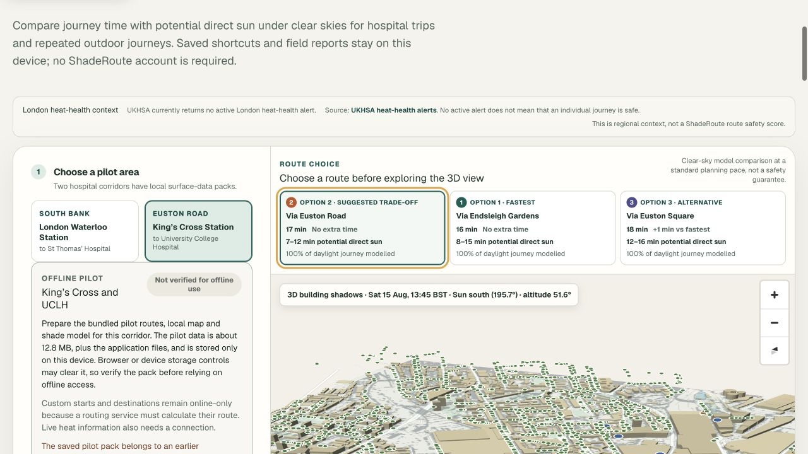
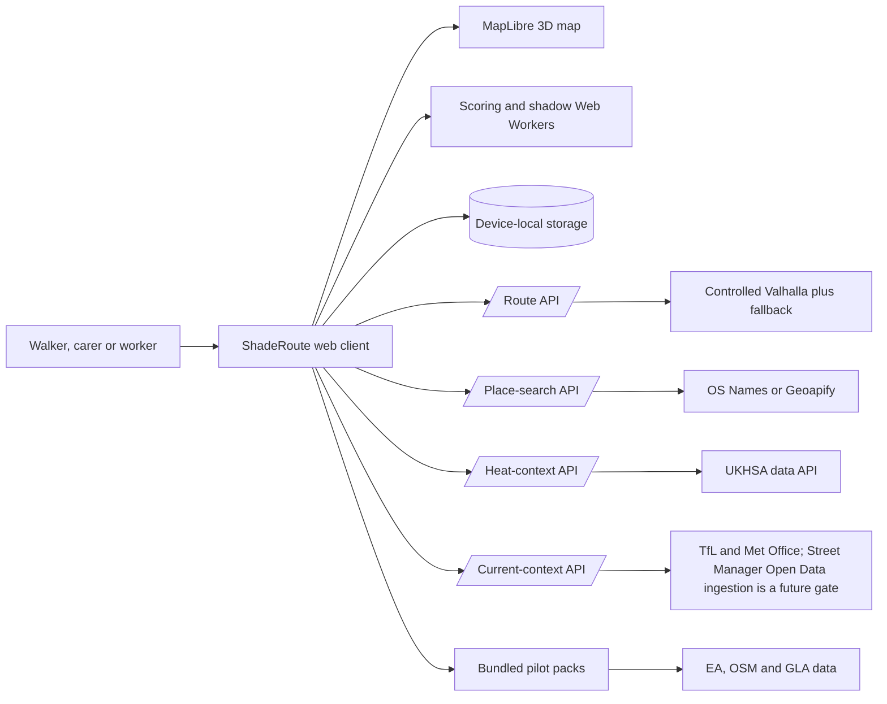
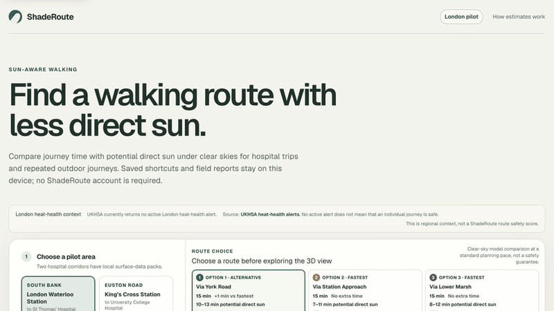
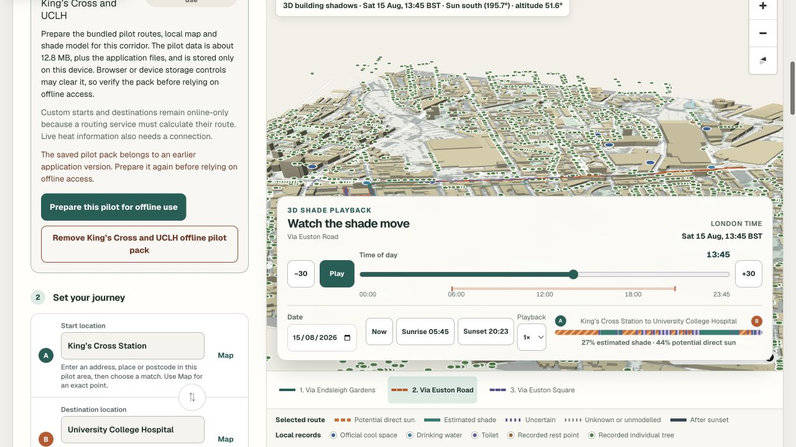
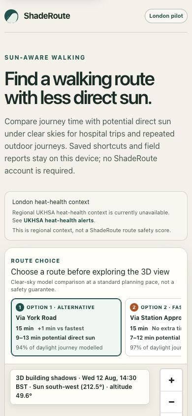
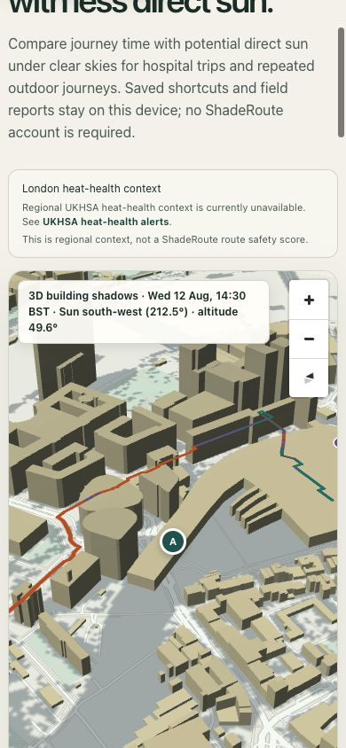

# ShadeRoute

> Mobile-first walking-route comparison using time-dependent clear-sky shade estimates.

[](https://github.com/MasteraSnackin/shade-route/actions/workflows/ci.yml)


## Description

ShadeRoute compares real walking alternatives by journey time and potential
direct-sun exposure. It is designed for heat-vulnerable people and their carers,
frontline staff and outdoor workers who repeat exposed journeys. The current
Frontline London prototype covers two hospital corridors:

- London Waterloo Station to St Thomas’ Hospital.
- King’s Cross Station to University College Hospital.

The application uses Environment Agency elevation data, a time-aware geometric
shade model and open walking routes to explain trade-offs rather than issue a
safety score. Missing model coverage is shown and conservatively counted as
potential direct sun. Physical field calibration is still pending.



[Watch the 2-minute 14-second demonstration](https://1drv.ms/v/c/220eb79e024bb8de/IQBUBT6BDhXfTpjArAMLUECIATI5m1yAdxERaeq5m6ABmSw?e=WG4hfg)
· [View the slides](https://1drv.ms/p/c/220eb79e024bb8de/IQAObMuJwcMHQZl4AM3bDRReAZ4pJ5oNVBf3PJWjuFZM_XY?e=Ffpm4h)
· [Run ShadeRoute locally](#installation)

| Prototype status | Current position |
| --- | --- |
| Coverage | Two bounded London hospital corridors |
| Shade evidence | Time-dependent clear-sky model; physical calibration pending |
| Routing | Real alternatives inside each pilot; no network-wide optimum claim |
| Availability | Local prototype; no public service or response-time commitment |

## Table of contents

- [Features](#features)
- [Technology stack](#technology-stack)
- [Architecture overview](#architecture-overview)
- [Installation](#installation)
- [Usage](#usage)
- [Configuration](#configuration)
- [Screenshots and demo](#screenshots-and-demo)
- [API reference](#api-reference)
- [Tests](#tests)
- [Data and responsible use](#data-and-responsible-use)
- [Roadmap](#roadmap)
- [Contributing](#contributing)
- [Licence](#licence)
- [Contact and support](#contact-and-support)

## Features

- Two bundled London hospital pilot corridors.
- One to three real route alternatives with time and potential direct-sun comparison.
- Arbitrary start and destination points inside each supported pilot area.
- Offline pilot landmarks plus optional OS Names or Geoapify place search, bounded to the active pilot.
- 3D MapLibre map with buildings and animated, time-dependent ground shadows.
- Selected-route sections marked as sun, shade, uncertain, unknown or night.
- Slow, standard and brisk planning presets without claiming measured walking speed.
- Repeated occupational journeys and a per-trip exposure timeline.
- Guarded departure advice that is withheld when evidence is weak or access rules conflict.
- Access, surface, crossing, data-age and coverage warnings.
- Device-local saved journeys and operational section feedback.
- Explicit, verified and removable offline packs for bundled pilot journeys.
- Strict local JSON decision-evidence export with exact coordinates and geometry excluded.
- Regional UKHSA heat-health context shown separately from route scoring.
- Optional TfL station/lift and Met Office weather/UV context; the Street Manager panel stays disabled pending approved Open Data ingestion.
- A loopback-only, self-hosted Greater London Valhalla profile and fixed synthetic checks for local pilots.
- An installable web-app manifest; verified corridor packs remain an explicit separate offline action.
- A model-first, device-local fixed-point calibration recorder with strict CSV export.
- Latest-request cancellation so stale routing or calculations cannot replace current results.

## Technology stack

| Layer | Technology |
| --- | --- |
| Application | React 19, TypeScript, Next.js App Router APIs, Vinext |
| Hosting runtime | Cloudflare-compatible Worker and static assets |
| Map | MapLibre GL JS |
| Solar position | SunCalc 2 |
| Routing | Valhalla pedestrian routing through a guarded server proxy |
| Model and context data | Environment Agency LiDAR DSM and DTM, OpenStreetMap, GLA Cool Space Data and GLA Public Realm Trees |
| Background work | Browser Web Workers with deterministic synchronous fallbacks |
| Device storage | LocalStorage and CacheStorage; no application server database |
| Tests | Node test runner, ESLint and TypeScript |

## Architecture overview



Most data and calculation work stays in the browser. The server exposes only
bounded proxies for live walking alternatives and regional heat context, while
personal shortcuts, feedback and offline data remain on the device. See
[ARCHITECTURE.md](ARCHITECTURE.md) for component responsibilities, invariants,
data flow and deployment details.

## Installation

### Requirements

- Node.js 24.14.0 and npm 11.9.0, as pinned in [`.nvmrc`](.nvmrc) and
  `package.json`.
- Docker Desktop or another Docker Compose runtime for the controlled local
  walking router. This is optional if only bundled routes are needed.
- A modern browser with WebGL for the full 3D map; the route comparison remains
  the primary decision surface.

### Set up from a clean checkout

```bash
git clone https://github.com/MasteraSnackin/shade-route.git
cd shade-route
nvm install
nvm use
npm ci
cp .env.example .env.local
docker compose -f ops/valhalla/compose.yml up -d
```

The first Valhalla start downloads the Greater London OpenStreetMap extract and
builds its graph, so readiness can take several minutes. No API key is required
for bundled routes or for explicitly enabled lower-volume anonymous TfL context.
OS Names, Geoapify and Met Office remain disabled until their server-side
settings are supplied. Street Manager cannot be enabled with a user token; see
the separate Open Data gate below.

## Usage

Start the local application:

```bash
npm run dev
```

Open <http://localhost:3000/> and:

1. Choose one of the two pilot corridors.
2. Set the departure time, audience, pace and access preference.
3. Compare the route cards before using the 3D map explanation.
4. Move the time control to see the ground-shadow pattern change.
5. Optionally prepare the selected bundled pilot for offline use.

Check the application, the controlled router and both fixed public pilot journeys:

```bash
npm run check:local-pilot
```

Create a production build:

```bash
npm run build
```

Rebuild pilot artefacts after deliberately updating source data under `data/`:

```bash
node scripts/prepare-data.mjs
node scripts/prepare-public-trees.mjs --check
```

Generated data must be reviewed, tested and attributed before it is committed.

## Configuration

All configuration is optional for the bundled pilots.

| Variable or file | Purpose | Default |
| --- | --- | --- |
| `VALHALLA_URL` | Server-only primary route endpoint | Loopback Valhalla at `127.0.0.1:8002`; no implicit public provider |
| `VALHALLA_FALLBACK_URL` | Server-only independent fallback route endpoint | Unset in code; `.env.example` uses FOSSGIS for local development only |
| `VALHALLA_*_AUTH_HEADER`, `VALHALLA_*_AUTH_TOKEN` | Optional bounded provider credentials | Unset |
| `ROUTE_REQUESTS_PER_MINUTE`, `ROUTE_MAX_CONCURRENT` | Per-runtime abuse and concurrency guard | `120`, `8` |
| `OS_NAMES_API_KEY` or `OS_DATA_HUB_API_KEY` | Optional OS Names search | Unset |
| `GEOAPIFY_API_KEY` | Optional address/place autocomplete fallback | Unset |
| `TFL_ALLOW_ANONYMOUS` | Permit cached lower-volume TfL requests without a key | Unset; `true` in `.env.example` |
| `TFL_API_KEY` | Optional higher-quota TfL access | Unset |
| `MET_OFFICE_API_KEY` | Optional Weather DataHub context | Unset |
| Street Manager Open Data ingestion | Registered notification ingestion and a current-state store for public journey-planning use | Not implemented; panel stays disabled |
| `.openai/hosting.json` | Logical Sites persistence bindings | D1 and R2 disabled |
| `public/data/` | Versioned pilot maps, routes, grids and context | Checked-in pilot artefacts |

Routing endpoints must use HTTPS. Loopback HTTP is accepted only for local
development and tests. Provider keys are read only by server routes and must
never be exposed to browser code. Place-search text and custom route endpoints
are forwarded only after an explicit user action; review provider retention
terms before a public pilot.

Street Manager's authenticated GeoJSON API does not use a durable API key: its
[official API guidance](https://department-for-transport-streetmanager.github.io/street-manager-docs/api-documentation/V6/V6.17.3/#jwt)
says the JWT ID token expires after one hour. More importantly,
DfT's third-party framework requires public-facing apps and journey-planning
services to take Street Manager data from the registered Open Data service, not
to re-serve data obtained with an authorised user's token. ShadeRoute therefore
has no Street Manager JWT environment variable or runtime provider call. Enabling
this panel requires Open Data registration, notification verification, missed-
event reconciliation, a bounded current-state store and an operator-owned data
retention process. See the [DfT third-party framework](https://department-for-transport-streetmanager.github.io/street-manager-docs/assets/files/third_party_framework.pdf)
and [Open Data guidance](https://department-for-transport-streetmanager.github.io/street-manager-docs/open-data/).

When enabled, OS Names results carry the current-year Crown copyright and
database-right statement with a link to the OS API terms. Geoapify results
retain the required `Powered by Geoapify` link; OpenStreetMap attribution
remains visible for its underlying data.

## Screenshots and demo

### Presentation and video

[Download the 2–3 minute presentation (PPTX)](docs/demo/shaderoute-frontline-london-demo.pptx)

[Watch the narrated 2-minute 14-second demonstration (MP4)](docs/demo/shaderoute-frontline-london-demo.mp4),
[download the English caption file](docs/demo/shaderoute-frontline-london-demo.en-GB.srt),
or [read the accessible transcript](docs/demo/shaderoute-frontline-london-demo-transcript.md).

The presentation opens with a user-supplied illustration. Where the product is
shown, the remaining slides and video use real ShadeRoute interface captures.
The revised video
demonstrates fullscreen, fit and zoom controls; overhead and 3D views; camera
rotation, tilt and reset; and accelerated shade playback from sunrise into the
evening. It also explains the qualified full-sun heat-index example, identifies
higher-risk groups, separates current from future features, and retains the
project limitation that physical field calibration is pending. Narration uses
ElevenLabs' Nora British product-demo voice with Eleven Multilingual v2.

### Product screenshots

[](docs/demo/shaderoute-frontline-london-demo.mp4)

The animated preview is silent; select it to watch the full narrated demonstration.

### Desktop

[](docs/demo/shaderoute-desktop-preview.gif)

[Open the 10-second desktop animation](docs/demo/shaderoute-desktop-preview.gif).

### Mobile

<table>
  <tr>
    <td align="center"><a href="docs/demo/shaderoute-mobile-shade-preview.gif"></a></td>
    <td align="center"><a href="docs/demo/shaderoute-mobile-map-preview.gif"></a></td>
  </tr>
  <tr>
    <td align="center"><a href="docs/demo/shaderoute-mobile-shade-preview.gif">Open the 10-second shade animation</a></td>
    <td align="center"><a href="docs/demo/shaderoute-mobile-map-preview.gif">Open the 10-second map-selection animation</a></td>
  </tr>
</table>

Only the featured preview above auto-plays in the README. The other animations
use static thumbnails to reduce data transfer and unexpected motion.

[Watch the shade-time interaction evidence (MP4)](docs/audit/shade-time-movement.mp4).
The recording shows the controlled clear-sky model changing from sunrise through
late morning; it is interface evidence, not field-validation evidence.

A public live URL has not been established because Sites is not enabled for the
current workspace. Run the project locally using the instructions above; do not
interpret a missing deployment URL as evidence that the application has been
field-validated.

## API reference

### `POST /api/route`

Returns up to three validated walking alternatives when both points are inside
the same supported pilot area.

```bash
curl -X POST http://localhost:3000/api/route \
  -H 'content-type: application/json' \
  --data '{
    "origin": {"lat": 51.5033, "lon": -0.1132},
    "destination": {"lat": 51.4983, "lon": -0.1187},
    "accessPreference": "avoid-known-steps"
  }'
```

Success:

```json
{
  "areaId": "waterloo",
  "routes": [
    {
      "id": "live-1",
      "distanceMetres": 1234,
      "durationSeconds": 901,
      "coordinates": [[-0.1132, 51.5033], [-0.1187, 51.4983]],
      "directions": []
    }
  ]
}
```

The real geometry contains more coordinates and may return fewer than three
alternatives. `accessPreference` accepts `standard` or `avoid-known-steps`.
The latter strongly penalises OpenStreetMap-mapped steps during routing, but it
does not prove that a route is step-free or that access data is complete.
Invalid inputs return `400`; temporary upstream failure returns
`503`. Every response is private and non-cacheable.

### `GET /api/heat-context`

Returns narrowly parsed London UKHSA context. It can return a time-limited stale
record when the provider is unavailable, a distinct `no_active_alert` result
when the documented UKHSA response is empty, or a neutral `503` unavailable
record. No active alert is not presented as assurance that a journey is safe.
This endpoint never changes route ranking.

### `POST /api/place-search`

Searches configured OS Names and Geoapify services, then strictly filters the
result to the requested pilot bounding box. Requests and responses are bounded,
private and rate-limited. If no provider succeeds, the client keeps its bundled
landmarks and amenities rather than inventing a result.

### `GET /api/current-context?area=waterloo|kings-cross`

Returns only fixed-corridor TfL and Met Office context, plus an explicit disabled
Street Manager state. Each live provider has an `available`, `disabled` or
`unavailable` state and a bounded stale fallback. The retained Street Manager
ingestion parser enforces an inclusive window from the current instant through
the next seven days and states its exact UTC bounds, ready for a future approved
Open Data pipeline. Historical and more distant future records are excluded.
Works records would not establish pavement closure, step-free access or route
safety and never alter shade ranking.

### `GET /api/health`

Returns a fixed, non-cacheable liveness record without disclosing provider
configuration. Dependency readiness is exercised separately by the fixed
`npm run check:local-pilot` synthetic checks.

There is no public CLI.

## Tests

Run the production build and all deterministic tests:

```bash
npm test
```

Run static checks separately:

```bash
npm run lint
npm run typecheck
```

Run the same complete release gate used before a pre-release:

```bash
npm run release:verify
```

The test suite covers route and API validation, timeout/fallback behaviour,
worker protocols, absolute-terrain shade geometry, London civil time, repeated
journeys, decision evidence, offline-pack atomicity, accessibility surface
requirements and responsible product claims.

Automated tests do not substitute for physical shade observations, real-device
offline checks, assistive-technology testing or user research.

## Data and responsible use

See [DATA-LICENSING.md](DATA-LICENSING.md) for dataset provenance, licences,
service terms and attribution requirements. These third-party permissions do
not grant a licence for ShadeRoute's own source code.

- **Routes and map:** OpenStreetMap contributors, ODbL.
- **Elevation:** Environment Agency LiDAR Composite DSM and DTM, Open Government
  Licence v3. Surveys in the composite may date from 2000–2022.
- **Cool spaces:** Greater London Authority Cool Space Data 2025 under London
  Datastore terms; listing and opening are not live.
- **Tree context:** GLA Public Realm Trees November 2025, OGL v3. Only records
  classified `Highways` inside each pilot plus a 250 m data-selection buffer
  are bundled. Inventory points do not establish a current tree, canopy or shade.
- **Solar geometry:** SunCalc 2.
- **Heat context:** official UKHSA London metric, displayed separately.
- **Current context:** TfL Open Data and Met Office Weather DataHub when enabled;
  the Department for Transport Street Manager slot remains disabled until a
  registered Open Data ingestion service exists.

ShadeRoute is an uncalibrated clear-sky geometric model. It does not measure
temperature, radiant heat, thermal comfort or heat-illness risk. It does not
certify routes as step-free, open or safe. Temporary works, foliage, clouds,
indoor sections, pavement position and current street conditions can differ.

The operational field form stores feedback about a modelled section; it is not
physical calibration evidence. A separate model-first observer can save strict
fixed-point records locally, but none become published evidence until a field
team follows the protocol, reviews and deliberately shares the export. The
protocol and empty repository template are in [`validation/`](validation/README.md).

## Roadmap

- Complete and publish field calibration across both corridors and varied sun angles.
- Add per-cell survey epoch and change detection to the model confidence surface.
- Prove offline reload and update behaviour on representative mobile devices.
- Operate the controlled router and privacy-bounded signals under a named public-pilot owner.
- Evaluate the experimental bounded Pareto path-search foundation on a controlled,
  time-bucketed pedestrian graph. It is not used by live route selection and is
  not evidence of a network-wide optimum.
- Validate horizon-angle acceleration before adopting it for wider-area packs.
- Expand geography only through tiled, provenance-aware model packs.

See [RESEARCHER.md](RESEARCHER.md) for the evidence-ranked technical roadmap.
The task-by-task completion record is in [TASK-TRACEABILITY.md](TASK-TRACEABILITY.md).

## Contributing

Read [CONTRIBUTING.md](CONTRIBUTING.md) before opening a change. It defines the
required safety framing, data provenance, tests and pull-request evidence.
Participation is also governed by the [Code of Conduct](CODE_OF_CONDUCT.md).

## Licence

No project-wide software licence has been declared. Do not assume permission to
reuse or redistribute the source until the maintainer adds a `LICENSE` file.
Making this repository public does not make it open source. The owner must make
and document the software-licence decision. The third-party terms in
[DATA-LICENSING.md](DATA-LICENSING.md) are separate from the software copyright.

## Contact and support

Read [SUPPORT.md](SUPPORT.md) for support boundaries and use
[GitHub Issues](https://github.com/MasteraSnackin/shade-route/issues) for public
bug reports and feature requests. Report security concerns using
[SECURITY.md](SECURITY.md). No response-time commitment is currently offered.
For an immediate medical or public-safety emergency, use the appropriate
emergency service rather than ShadeRoute.
